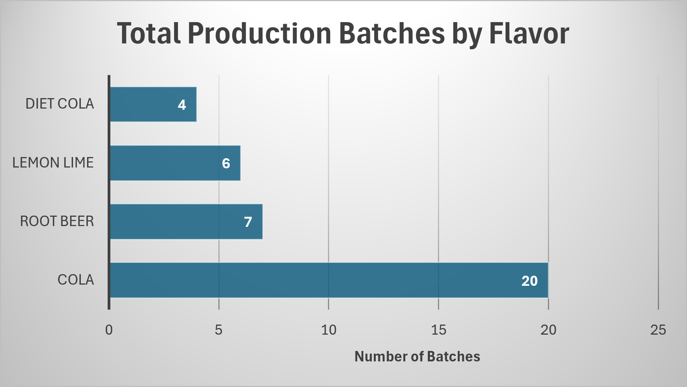
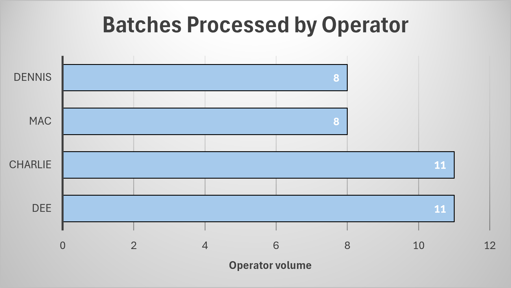

# Manufacturing Production & Downtime Analysis Using SQL

## Project Overview

Manufacturing organizations must continuously monitor production efficiency and identify opportunities to reduce downtime and improve throughput.

This project analyzes manufacturing production data using SQL to uncover operational trends, evaluate operator performance, and identify opportunities for process improvement.


## Business Questions

1. Which products were produced the most?
2. Which operators processed the most batches?
3. Which flavors required the longest production times?
4. Which operator and flavor combinations had the highest average processing times?
5. What operational improvement opportunities exist?


## Tools Used

- SQLite
- SQL
- DB Browser for SQLite
- Microsoft Excel
- GitHub


## SQL Skills Demonstrated

- SELECT
- DISTINCT
- WHERE
- GROUP BY
- ORDER BY
- COUNT()
- AVG()
- JOINS
- Aliases
- Date & Time Calculations
- Data Exploration
- Business KPI Analysis


## Key Findings

- Cola was the highest-volume product with **20 production batches**.
- Charlie processed the greatest number of batches (**8 batches**).
- Orange flavor required the longest average production time (**135 minutes**).
- Orange production performed by Mac recorded the highest average processing time (**135 minutes**).


## Recommendations

- Investigate Orange production workflows to identify bottlenecks.
- Review setup procedures associated with Orange batches.
- Analyze best practices from high-performing operators.
- Continue monitoring cycle times to improve production efficiency.


## Repository Structure

```text 
Manufacturing-Downtime-SQL-Analysis
│
├── Data
├── Images
├── SQL
│   ├── 01_data_exploration.sql
│   └── 02_production_analysis.sql
└── README.md
```

## Visualizations

### Production Volume by Flavor

This chart shows the total number of production batches completed for each product flavor. Cola represented the highest production volume with 20 batches.




### Batches Processed by Operator

This chart shows total production batches completed by each operator. Charlie & Dee processed the highest number of batches with 11.


